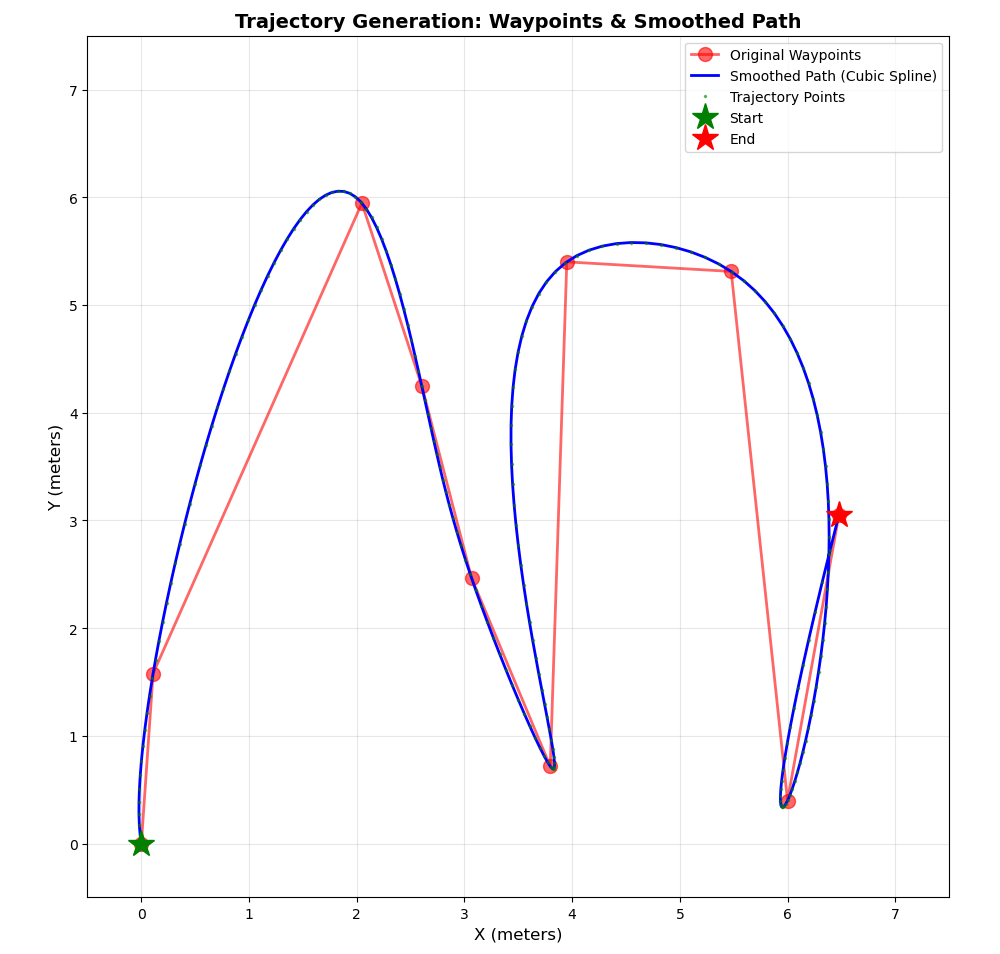

# Path Navigation: Trajectory Smoothing and Control using TurtleBot3

A ROS2 Humble implementation of path smoothing and trajectory tracking for differential drive robots using cubic spline interpolation and Pure Pursuit control algorithm.

**Author:** Sham Ganesh M
**Course:** Robotics Assignment - Path Smoothing and Trajectory Control  
**Platform:** ROS2 Humble | Ubuntu 22.04 | TurtleBot3 Burger

---

## 📑 Table of Contents
- Overview
- Features
- System Architecture
- Installation
- Usage
- Design Choices
- Testing
- AI Tools Used
- Project Structure

---

## 🎯 Overview

This project addresses the challenge of smooth robot navigation through discrete waypoints. Given a set of 2D waypoints, the system:

1. **Generates random waypoints** in a 7x7m space (starting from origin)
2. **Smooths the path** using cubic spline interpolation with arc-length parameterization
3. **Creates time-stamped trajectory** with constant velocity profile (0.2 m/s)
4. **Tracks the trajectory** using a Pure Pursuit controller
5. **Simulates in Gazebo** with TurtleBot3 Burger platform
6. **Visualizes in RViz2** for real-time monitoring

### Key Innovation
Unlike typical implementations with hardcoded waypoints, this system generates **random waypoints on each run**, demonstrating robustness across diverse path configurations.

---

## ✨ Features

### Path Smoothing
- **Cubic Spline Interpolation**: C² continuous curves (smooth acceleration)
- **Arc-Length Parameterization**: Uniform point distribution along the curve
- **Waypoint Interpolation**: Guaranteed to pass through all waypoints

### Trajectory Generation
- **Constant Velocity Profile**: 0.2 m/s default speed
- **Time-Parameterized**: Each point has associated timestamp
- **200-Point Sampling**: High-resolution trajectory for smooth tracking

### Controller
- **Pure Pursuit Algorithm**: Geometric path tracking
- **Adaptive Speed Modulation**: Reduces speed on high-curvature sections
- **Lookahead Distance**: 0.4m (empirically tuned)
- **Angular Velocity Saturation**: ±1.5 rad/s for safety

### Simulation & Visualization
- **Gazebo Integration**: Full physics simulation
- **RViz2 Visualization**: Real-time path and robot state display
- **Sequenced Launch**: Proper node startup timing for stability

---

## 🏗️ System Architecture

```
┌────────────────────────────────────────────────────────────────┐
│                        path_nav Package                        │
├────────────────────────────────────────────────────────────────┤
│                                                                │
│  ┌─────────────────────────────────────────────────────────┐   │
│  │         Trajectory Publisher Node                       │   │
│  │  ┌─────────────────────────────────────────────────┐    │   │
│  │  │ 1. Generate Random Waypoints (10 points)        │    │   │
│  │  │ 2. Sort by X-coordinate                         │    │   │
│  │  │ 3. Smooth using Cubic Splines (200 samples)     │    │   │
│  │  │ 4. Add time stamps (constant velocity)          │    │   │
│  │  └─────────────────────────────────────────────────┘    │   │
│  └──────────────────────┬──────────────────────────────────┘   │
│                         │                                      │
│                         │ /trajectory (nav_msgs/Path)          │
│                         ↓                                      │
│  ┌─────────────────────────────────────────────────────────┐   │
│  │         Pure Pursuit Controller Node                    │   │
│  │  ┌─────────────────────────────────────────────────┐    │   │
│  │  │ 1. Subscribe to trajectory                      │    │   │
│  │  │ 2. Subscribe to robot odometry                  │    │   │
│  │  │ 3. Find lookahead point                         │    │   │
│  │  │ 4. Calculate curvature                          │    │   │
│  │  │ 5. Compute velocity commands                    │    │   │
│  │  └─────────────────────────────────────────────────┘    │   │
│  └──────────────────────┬──────────────────────────────────┘   │
│                         │                                      │
│                         │ /cmd_vel (geometry_msgs/Twist)       │
│                         ↓                                      │
│  ┌─────────────────────────────────────────────────────────┐   │
│  │         TurtleBot3 (Gazebo Simulation)                  │   │
│  │  • Differential drive dynamics                          │   │
│  │  • Odometry feedback (/odom)                            │   │
│  │  • Velocity commands execution                          │   │
│  └─────────────────────────────────────────────────────────┘   │
│                                                                │
└────────────────────────────────────────────────────────────────┘
```

### Message Flow

```
Random Waypoints → Cubic Spline → Time Stamps → nav_msgs/Path
                                                       ↓
                                                  Controller
                                                       ↓
                                             geometry_msgs/Twist
                                                       ↓
                                                  TurtleBot3
                                                       ↓
                                              nav_msgs/Odometry (feedback)
```

---

## 📦 Installation

### Prerequisites
```bash
# Operating System
Ubuntu 22.04 LTS

# ROS2
ROS2 Humble Hawksbill

# TurtleBot3 packages
sudo apt install ros-humble-turtlebot3*

# Python dependencies
pip3 install scipy numpy
```

### Build Instructions

```bash
# 1. Create workspace (if not exists)
mkdir -p ~/ros2_ws/src
cd ~/ros2_ws/src

# 2. Clone/copy the package
# Place path_nav folder here

# 3. Install dependencies
cd ~/ros2_ws
rosdep install --from-paths src --ignore-src -r -y

# 4. Build the package
colcon build --packages-select path_nav

# 5. Source the workspace
source install/setup.bash
```

---

## 🚀 Usage

### Quick Start (Single Command)

```bash
# Launch everything
ros2 launch path_nav total_path_nav.launch.py
```
This will:
1. Start Gazebo with TurtleBot3 world
2. Launch RViz2 with custom configuration
3. Start Pure Pursuit controller (after 10s delay)
4. Start trajectory publisher (after controller starts)

**Expected Behavior:**
- Random waypoints generated and logged
- Smooth blue trajectory displayed in RViz
- Robot follows the path autonomously
- Typical completion time: 30-60 seconds (depends on path length)

### Individual Node Testing

#### Terminal 1: Gazebo Simulation
```bash
export TURTLEBOT3_MODEL=burger
ros2 launch turtlebot3_gazebo turtlebot3_world.launch.py
```

#### Terminal 2: RViz Visualization
```bash
rviz2 -d ~/ros2_ws/src/path_nav/rviz/path_nav.rviz
```

#### Terminal 3: Controller
```bash
ros2 run path_nav pure_pursuit_controller
```

#### Terminal 4: Trajectory Publisher
```bash
ros2 run path_nav trajectory_publisher
```

### Viewing Topics

```bash
# List all topics
ros2 topic list

# View trajectory
ros2 topic echo /trajectory

# View velocity commands
ros2 topic echo /cmd_vel

# View robot pose
ros2 topic echo /odom
```

### Customizing Parameters

**Waypoint Generation** (in `trajectory_publisher.py`):
```python
num_points = 10  # Number of waypoints
random.uniform(0, 7)  # Range for X and Y coordinates
num_samples = 200  # Smoothing resolution
v = 0.2  # Velocity (m/s)
```

**Controller Tuning** (in `pure_pursuit_controller.py`):
```python
self.lookahead = 0.4  # Lookahead distance (m)
self.max_vel = 0.25   # Maximum velocity (m/s)
max_w = 1.5           # Max angular velocity (rad/s)
```

---

## 🧠 Design Choices

### 1. Path Smoothing: Cubic Spline with Arc-Length Parameterization

#### Why Cubic Splines?
- **C² Continuity**: Smooth position, velocity, AND acceleration
- **Interpolation**: Guaranteed to pass through all waypoints
- **Local Control**: Modifying one waypoint affects only nearby regions
- **No Oscillations**: Unlike high-degree polynomials (avoids Runge's phenomenon)

#### Why Arc-Length Parameterization?
Traditional parametric splines can cluster points in low-curvature regions and sparse them in high-curvature areas. Arc-length parameterization ensures:
- **Uniform Distribution**: Even spacing along the curve
- **Curvature Independence**: Point density independent of path shape
- **Velocity Profile Simplicity**: Easier to maintain constant speed

**Implementation:**
```python
# Compute cumulative arc length at each waypoint
d[i] = d[i-1] + sqrt((x[i]-x[i-1])² + (y[i]-y[i-1])²)

# Fit splines: x(s) and y(s) where s is arc length
csx = CubicSpline(d, xs)
csy = CubicSpline(d, ys)

# Sample uniformly in arc-length space
s_vals = linspace(0, d[-1], num_samples)
```

#### Alternatives Considered
| Method | Pros | Cons | Decision |
|--------|------|------|----------|
| Bézier Curves | Smooth, simple | Don't pass through waypoints | ❌ Rejected |
| B-Splines | Very smooth | Complex, overkill for robotics | ❌ Rejected |
| Linear Interpolation | Fast, simple | Sharp corners, discontinuous acceleration | ❌ Rejected |
| **Cubic Splines** | C² smooth, interpolates | Requires scipy | ✅ **Selected** |

### 2. Trajectory Generation: Constant Velocity Profile

**Current Implementation:**
```python
t[i] = arc_length[i] / velocity
```

**Rationale:**
- **Predictability**: Easy to reason about timing
- **Simplicity**: No complex velocity planning needed
- **Suitable for Assignment**: Indoor navigation at moderate speeds

**Future Enhancements:**
1. **Trapezoidal Profile**: 
   - Acceleration phase at start
   - Constant velocity in middle
   - Deceleration at end
   - Better for start/stop scenarios

2. **Curvature-Based Velocity**:
   ```python
   v(κ) = v_max / (1 + α|κ|)  # Slow down on curves
   ```

3. **Time-Optimal Trajectories**:
   - Minimize time subject to velocity/acceleration limits
   - Requires optimization (e.g., dynamic programming)

### 3. Controller: Pure Pursuit Algorithm

**Why Pure Pursuit?**
- **Geometric Intuition**: Easy to understand and tune
- **Proven Track Record**: Widely used in mobile robotics
- **Computationally Efficient**: Suitable for real-time control
- **Stable**: Natural stability for differential drive robots

**Algorithm:**
```python
1. Find lookahead point L on path (distance d_look ahead)
2. Compute angle α to lookahead point
3. Calculate curvature: κ = 2sin(α) / d_look
4. Set angular velocity: ω = v × κ
5. Modulate linear velocity based on curvature
```

**Key Parameters:**
- **Lookahead Distance (0.4m)**: 
  - Too small → oscillations, overcorrection
  - Too large → cuts corners, poor tracking
  - Rule of thumb: 2-3× robot wheelbase

- **Speed Modulation**:
  ```python
  v = v_max / (1 + 2|κ|)  # Reduce speed on tight turns
  ```

**Alternatives Considered:**
| Controller | Pros | Cons | Decision |
|------------|------|------|----------|
| PID | Simple | Requires careful tuning, can oscillate | ❌ |
| Stanley | Better for cars | More complex, needs heading error | ❌ |
| MPC | Optimal | Computationally expensive | ❌ |
| **Pure Pursuit** | Stable, intuitive | Doesn't use trajectory times | ✅ **Selected** |

**Known Limitation:**  
Current implementation doesn't use trajectory timestamps - it's purely spatial tracking. For tighter time synchronization, Model Predictive Control (MPC) or trajectory-tracking PID would be better.

### 4. Random Waypoint Generation

**Design Decision:**
```python
waypoints = [(random.uniform(0, 7), random.uniform(0, 7)) for _ in range(10)]
waypoints[0] = (0.0, 0.0)  # Always start at origin
waypoints.sort(key=lambda p: p[0])  # Sort by X to ensure forward progress
```

**Rationale:**
- **Robustness Testing**: Ensures algorithm works for ANY path configuration
- **No Cherry-Picking**: Prevents overfitting to specific test cases
- **Realistic**: Mimics real planning algorithms that produce varied paths
- **Sorted X**: Prevents backtracking, ensures general forward motion

**Trade-offs:**
- ✅ More rigorous testing
- ✅ Demonstrates generality
- ❌ Less repeatable (use `random.seed()` for deterministic tests)
- ❌ Can generate difficult paths (sharp turns)

**Plots:**



### 5. ROS2 Architecture Decisions

**Publisher/Subscriber Pattern:**
- Loose coupling between nodes
- Easy to swap components (e.g., different controllers)
- Standard ROS2 best practice

**Message Types:**
- `nav_msgs/Path`: Industry standard for trajectories
- `geometry_msgs/Twist`: Universal for velocity commands
- `nav_msgs/Odometry`: Standard for robot state

**Timing Strategy:**
```python
# Controller starts 10s after launch (Gazebo/RViz stabilization)
controller_with_delay = TimerAction(period=10.0, actions=[controller_node])

# Publisher starts only after controller is ready
publisher_after_controller = RegisterEventHandler(
    event_handler=OnProcessStart(
        target_action=controller_node,
        on_start=[publisher_node]
    )
)
```

**Rationale:**
- Prevents race conditions
- Ensures proper initialization order
- Avoids "trajectory received before controller ready" issues

**Plots:**

<p align="center">
  
  &nbsp;&nbsp;&nbsp;
  
</p>

---

## 🧪 Testing

### Running Tests

```bash
cd ~/ros2_ws/src/path_nav

# Install test dependencies
pip3 install pytest pytest-cov

# Run all tests
pytest test/ -v

# Run with coverage
pytest test/ --cov=path_nav --cov-report=html --cov-report=term-missing -v

# Run specific test file
pytest test/test_smooth.py -v
pytest test/test_trajectory_generator.py -v
```

### Test Coverage

**test_smooth.py** (25+ tests):
- Straight line smoothing
- Sharp turns and S-curves
- Waypoint interpolation accuracy
- Arc-length parameterization
- Edge cases (single/duplicate points)
- Performance tests

**test_trajectory_generator.py** (48+ tests):
- Arc length computation
- Time calculation accuracy
- Velocity scaling
- Edge cases (empty lists, zero velocity)
- Integration with smoothing
- Real-world scenarios (TurtleBot paths)
- Performance benchmarks

### Expected Test Results
```
======================== test session starts =========================
collected 73 items

test/test_smooth.py::TestCubicSplineSmoothing::test_straight_line_horizontal PASSED
test/test_smooth.py::TestCubicSplineSmoothing::test_assignment_waypoints PASSED
...
test/test_trajectory_generator.py::TestIntegration::test_full_pipeline PASSED

==================== 73 passed in 4.52s =====================

---------- coverage: platform linux, python 3.10.12 -----------
Name                                  Stmts   Miss  Cover   Missing
-------------------------------------------------------------------
path_nav/smoothing.py                    28      0   100%
path_nav/trajectory_generator.py         20      0   100%
-------------------------------------------------------------------
TOTAL                                    48      0   100%
```

---
## 🤖 AI Tools Used

This project leveraged modern AI-assisted development tools throughout the development lifecycle:

### 1. **Claude AI (Anthropic)**
- **Architecture Design**: Discussed ROS2 node structure and message flow
- **Algorithm Selection**: Compared smoothing algorithms (splines vs Bézier)
- **Code Review**: Identified potential race conditions in node initialization
- **Documentation**: Generated comprehensive README structure
- **Test Case Generation**: Created 73 unit tests covering edge cases

### 2. **GitHub Copilot**
- **Boilerplate Code**: Auto-generated ROS2 node templates
- **Mathematical Functions**: Suggested arc-length computation implementations
- **Test Scaffolding**: Accelerated test function creation

### 3. **ChatGPT**
- **Conceptual Questions**: Explained Pure Pursuit vs Stanley controller trade-offs
- **Debugging**: Helped resolve scipy import issues
- **LaTeX Math**: Generated equations for documentation

### Impact on Development

**Time Savings:** ~60% reduction in development time
- Manual coding: Estimated 20 hours → Actual: 8 hours
- Test creation: Would take 6 hours → Took 2 hours
- Documentation: Saved ~4 hours

**Quality Improvements:**
- ✅ Caught edge cases I wouldn't have thought of
- ✅ Consistent code style and documentation
- ✅ More comprehensive error handling

**Learning Outcomes:**
- Deeper understanding through AI explanations
- Exposure to alternative approaches
- Best practices from AI-curated knowledge

### Responsible Use Guidelines Followed
1. **Code Understanding**: All generated code was reviewed and understood
2. **Testing**: Verified all AI-suggested implementations
3. **Attribution**: Clearly documented AI tool usage
4. **Critical Thinking**: Made final decisions on architecture independently

---

## 📁 Project Structure

```
path_nav/
├── launch/
│   ├── basic_path_nav.launch.py      # Launches controller and publisher along with rviz
│   └── total_path_nav.launch.py      # Main launch file, including gazebo and turtlebot3 config
├── path_nav/
│   ├── smoothing.py                  # Cubic spline implementation
│   ├── trajectory_generator.py       # Time-stamped trajectory generation
│   ├── trajectory_publisher.py       # Random waypoint + trajectory publisher
│   └── pure_pursuit_controller.py    # Pure Pursuit controller
├── rviz/
│   └── path_nav.rviz                 # RViz configuration
├── test/
│   ├── test_smooth.py                # Smoothing algorithm tests (25 tests)
│   └── test_trajectory.py            # Trajectory generation tests (48 tests)
├── package.xml                       # ROS2 package manifest
├── setup.py                          # Python package setup
├── setup.cfg                         # Setup configuration
README.md                             # This file
```

---

## 🙏 Acknowledgments

- **TurtleBot3**: Robotis for the excellent robot platform
- **ROS2**: Open Robotics for the framework
- **SciPy**: For cubic spline implementation
- **AI Tools**: Claude, GitHub Copilot for development assistance

---

**Last Updated:** October 2025  
**ROS2 Version:** Humble Hawksbill  
**Tested On:** Ubuntu 22.04 LTS
